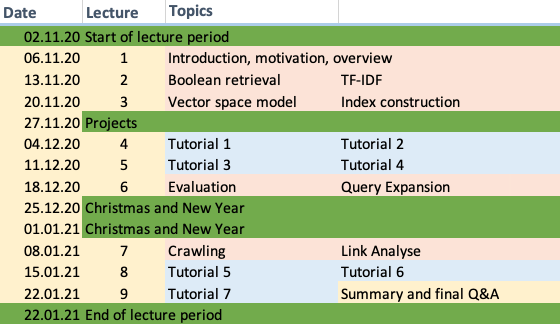

# Information Retrieval 2020 (DIS12)

## Schedule and Resources 

All lectures will be hosted on Zoom: https://th-koeln.zoom.us/j/87016873511. The password for Zoom is the ZIP code of  TH Köln @ Claudiusstraße 1. 

The lectures are based on the *flipped-classroom principle*. One week before the actual lectures we will release the slides and video for the specific topic. At the following dates we discuss the corresponding topics in depth. You are required to watch all videos *before* the Zoom meetings. I will not start all over again but expect you to be prepared.

## Slides and online lecture archive

Please feel free to comment on all the slides available. Open up a ticket if you find anything I should update or fix. Please be aware that the videos are from a parallel course with the lecture code BM24. Don't get confused.

| Date                | Topic                               | Resources      |
|---------------------|-------------------------------------|----------------|
| 2020-11-06 at 13:30 | Syllabus                            | [pdf](slides/DIS12-00-syllabus.pdf) |
| 2020-11-06 at 14:00 | Introduction and Overview           | [pdf](slides/DIS12-01-introduction.pdf), [video](https://youtu.be/g58QPBqKJgk) |
| 2020-11-13 at 13:30 | Boolean Retrieval                   | [pdf](slides/DIS12-02-boolean.pdf), [video](https://youtu.be/EcPBqIM3uO0) |
| 2020-11-13 at 15:15 | TF-IDF                              | [pdf](slides/DIS12-03-tfidf.pdf), [video](https://youtu.be/CPrij20NmXY) |
| 2020-11-20 at 13:30 | Vector Space Model                  | [pdf](slides/DIS12-04-ranking.pdf), [video](https://youtu.be/b1JanvFBlWU) |
| 2020-11-20 at 13:30 | Indexing, Terms and Token.s         | [pdf](slides/DIS12-05-index.pdf), [video](https://youtu.be/GdU5SN7q0G0) |
| 2020-12-04 at 13:30 | Exercise Boolean Retrieval          | [exercise](exercises/DIS12-02-boolean-exercise.pdf) |
| 2020-12-04 at 15:15 | Exercise TF-IDF                     | [exercise](exercises/DIS12-03-tfidf-exercise.pdf), [shakespeare.zip](exercises/shakespeare.zip) |
| 2020-12-11 at 13:30 | Exercise Vector Space Model         | [exercise](exercises/DIS12-04-ranking-exercise.pdf) |
| 2020-12-11 at 15:15 | Exercise Indexing, Terms and Tokens | [exercise](exercises/DIS12-05-index-exercise.pdf)     |
| 2020-12-18 at 13:30 | Evaluation                          | [pdf](slides/DIS12-06-evaluation.pdf), [video](https://youtu.be/DDfa685DFfw) |
| 2020-12-18 at 15:15 | Query Expansion                     | [pdf](slides/DIS12-07-queryexpansion.pdf), [video](https://youtu.be/4KMtwZ98vmA) |
| 2021-01-08 at 13:30 | Web Crawling                        | [pdf](slides/DIS12-08-webcrawling.pdf), [video](https://youtu.be/7WldGmUVztE) |
| 2021-01-08 at 15:15 | Link Analysis                       | [pdf](slides/DIS12-09-linkanalysis.pdf), [video](https://youtu.be/ppqwuVAw_oA) |
| 2021-01-15 at 13:30 | Exercise Evaluation                 | [exercise](exercises/DIS12-06-evaluation-exercise.pdf)    |
| 2021-01-15 at 15:15 | Exercise Query Expansion            | [exercise](exercises/DIS12-07-queryexp-exercise.pdf)    |
| 2021-01-22 at 13:30 | Exercise Web Crawling + Link Analysis | [exercise](exercises/DIS12-08-webcrawling-linkanalysis-exercise.pdf) |
| 2021-01-22 at 15:15 | Q&A Session on everything           | [discussion board](https://github.com/irgroup/dis12-2020/discussions)    |
